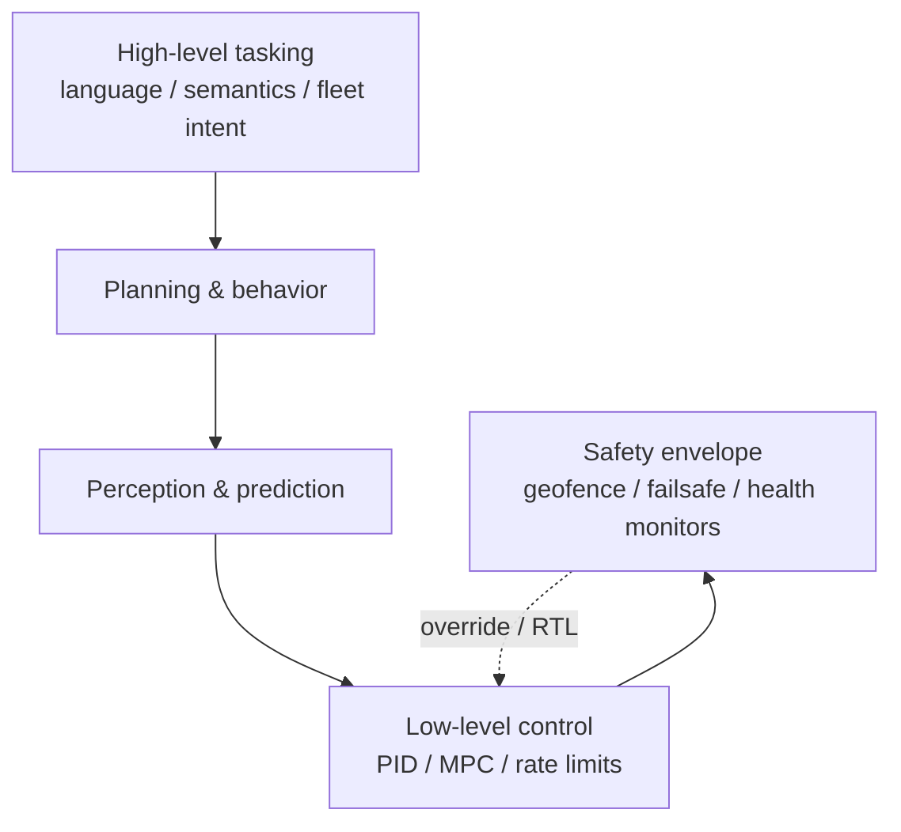
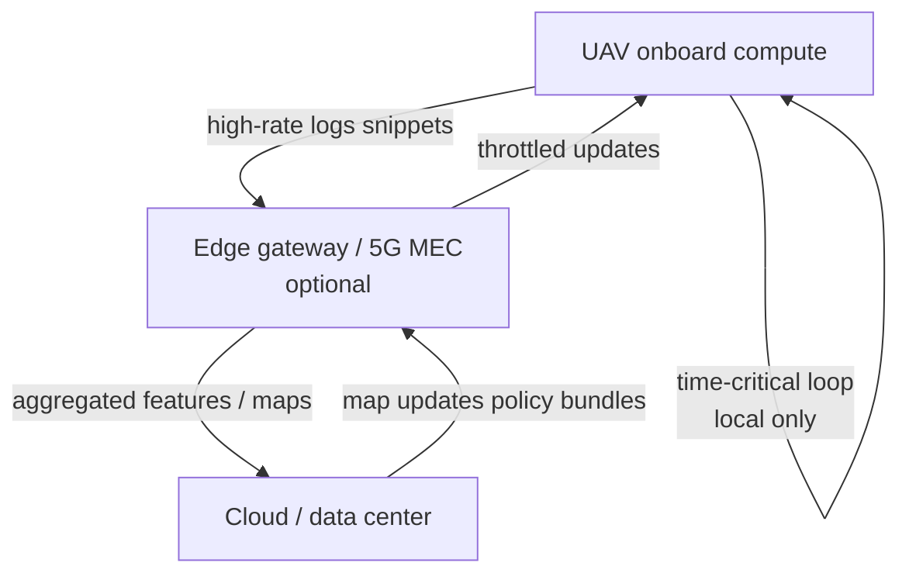

# Embodied Artificial Intelligence in Drone Technologies

**Document type:** Technical report (internal reference)  
**Subject:** Concepts, architectures, workflows, and literature for embodied AI applied to unmanned aerial systems (UAS)  
**Version:** 1.0  
**Date:** 14 May 2026  

---

## Table of contents

1. [Purpose and scope](#1-purpose-and-scope)  
2. [Executive summary](#2-executive-summary)  
3. [Definitions: embodied AI](#3-definitions-embodied-ai)  
4. [Embodied AI versus classical autonomy](#4-embodied-ai-versus-classical-autonomy)  
5. [Core technical pillars](#5-core-technical-pillars)  
6. [Why drones are a demanding embodiment domain](#6-why-drones-are-a-demanding-embodiment-domain)  
7. [Application map: where embodied AI fits in drone stacks](#7-application-map-where-embodied-ai-fits-in-drone-stacks)  
8. [Reference system architecture](#8-reference-system-architecture)  
9. [Workflows](#9-workflows)  
10. [Data, training, and evaluation](#10-data-training-and-evaluation)  
11. [Risks and mitigations](#11-risks-and-mitigations)  
12. [Application to organizational drone programs](#12-application-to-organizational-drone-programs)  
13. [Suggested learning path](#13-suggested-learning-path)  
14. [References and further reading](#14-references-and-further-reading)  
15. [Closing summary](#15-closing-summary)  

---

## 1. Purpose and scope

This report explains what **embodied artificial intelligence** means, how it differs from conventional software and disembodied “chat-style” AI, which technical ideas matter for physical agents, and how those ideas map to **unmanned aerial systems (UAS / drones)**—including perception, planning, control, human interaction, and safe operation in the real world.

**Scope:** Conceptual foundations, typical system layers, operational workflows, risks, and a curated set of **recent surveys and research papers** (2025–2026) relevant to aerial embodied intelligence, vision-language-action (VLA) models, and vision-language navigation (VLN).  

**Out of scope:** Jurisdiction-specific regulatory filings, airworthiness certification steps for a particular class of aircraft, and proprietary vendor benchmarks.

---

## 2. Executive summary

**Embodiment** ties intelligence to a **physical body** in space and time: the system **senses** through onboard or body-mounted sensors, **acts** through actuators, and operates in a **closed perception–action loop** where actions change future observations under **uncertainty** (wind, lighting, sensor faults, dynamic obstacles).

**Embodied AI** is the engineering and science of policies, models, and architectures that improve that loop: representation, prediction, decision-making, and control under **latency, power, and safety** constraints. It often combines **classical robotics** (estimation, geometric planning, control) with **learning** (deep perception, imitation or reinforcement learning, foundation-model-style reasoning) and increasingly with **vision–language–action (VLA)** pipelines for language-conditioned behavior.

For **drones**, embodied AI is attractive for hard perception, reduced operator load, semantic missions, and language-guided goals—but **production systems** still anchor safety in **deterministic envelopes** (geofences, failsafes, verified low-level control) and rigorous validation, with high-level AI constrained to **safe skill libraries** where needed.

---

## 3. Definitions: embodied AI

### 3.1 Embodiment

An embodied intelligent system:

1. **Senses** the world (e.g. cameras, IMU, lidar, rangefinders, GNSS, barometer, magnetometer).  
2. **Maintains internal representations** of state and surroundings (pose, maps, semantics, uncertainty).  
3. **Acts** through actuators (rotors, control surfaces, servos, gimbals, payload releases, lighting, communication).  
4. **Closes the loop**: the world and the robot’s pose evolve; the next sensor readings depend on prior actions and disturbances that are **not** fully predictable from software alone.

### 3.2 Embodied AI (working definition)

**Embodied AI** denotes computational methods that **improve closed-loop behavior** of a physical agent: perception, prediction, planning, control, and interaction—typically using **data**, **simulation**, and **feedback** from real deployments.

A useful operational slogan: **embodied AI is not only “knowing facts”; it is “doing the right thing in the world, on time, under uncertainty.”**

### 3.3 Disembodied AI (contrast)

**Disembodied** systems lack a continuous physical loop (e.g. batch document classification, offline analytics, or a text assistant with no motors). They may still use large models, but they do not face the same **hard real-time coupling** between sensing, dynamics, and safety.

---

## 4. Embodied AI versus classical autonomy

**Classical drone autonomy** stacks—state estimation, mapping, planning, control—are **embodied** physically but were historically **hand-engineered** (filters, geometric planners, PID gains tuned per platform).

**Modern embodied AI** usually adds one or more of:

- **Learned perception or prediction** (detection, segmentation, depth, wind or disturbance cues).  
- **Learned or hybrid planning and control** (imitation learning, reinforcement learning, learned residuals on a baseline controller).  
- **High-level reasoning grounded in sensors and actions** (scene understanding, language-conditioned goals, contingency selection).

**Summary:** Classical autonomy answers *how the vehicle flies* with explicit models and rules. Embodied AI emphasizes **learning, generalization, and rich perception/semantics** in the same loop, with **data and simulation** as first-class engineering assets.

---

## 5. Core technical pillars

### 5.1 Perception–action loop

The central cycle (often implemented as **multiple loops** at different frequencies):

1. **Sense**  
2. **Estimate state** (pose, velocity, wind, obstacles, mission progress)  
3. **Decide** (goals, constraints, contingencies)  
4. **Actuate**  
5. **World evolves** → return to (1)

Embodied AI targets **end-to-end quality** of this loop or critical submodules (e.g. obstacle perception feeding a safety filter).

### 5.2 Representation

Representations used in aerial systems include:

- **Geometric:** occupancy grids, Euclidean signed distance fields (ESDF), point clouds, meshes.  
- **Semantic:** object classes, text labels, affordances (e.g. “landable”, “inspectable surface”).  
- **Latent / learned:** embeddings that support control but are not directly human-interpretable.

Strong systems often **fuse** geometry and semantics (e.g. “vertical structure” plus “power line” changes risk and maneuver policy).

### 5.3 Uncertainty

UAS face **sensor dropout**, **GNSS degradation or denial**, **motion blur**, **glare**, **wind gusts**, and **dynamic obstacles**. Methods range from classical probabilistic filters to learned uncertainty estimates; **conservative safety margins** and **monitoring** remain essential.

### 5.4 Simulation, domain randomization, and sim-to-real

Training in **simulation** (e.g. Gazebo-class engines, photorealistic simulators, game engines, GPU robotics stacks) plus **domain randomization** (lighting, texture, wind, latency, sensor noise) is standard because **real flight data is costly and risky**.

The **sim-to-real gap** remains a core engineering problem: policies must be validated under **real actuator limits, delays, and calibration**.

### 5.5 World models

A **world model** predicts how the world and the robot evolve under candidate actions—supporting planning, model predictive control (MPC), reinforcement learning, or “mental simulation” before a maneuver. Recent surveys organize world models by functionality, time horizon, and spatial representation; see [Hu et al., arXiv:2510.16732](https://arxiv.org/abs/2510.16732).

### 5.6 Vision–language–action (VLA) and vision–language navigation (VLN)

**VLA** models map **vision + language** to **actions** (or action sequences), reducing fragmentation among separate vision, NLP, and low-level stacks. They support goals such as **natural-language tasking** or **open-vocabulary object-relative navigation**.

**VLN** emphasizes **navigation** under language instructions, often with monocular or limited sensing; aerial variants are an active research thread.

Authoritative surveys and “anatomy” treatments of VLA include:

- [“Vision-Language-Action Models: Concepts, Progress, Applications and Challenges”](https://arxiv.org/abs/2505.04769) (arXiv:2505.04769).  
- [“An Anatomy of Vision-Language-Action Models: From Modules to Milestones and Challenges”](https://arxiv.org/abs/2512.11362) (arXiv:2512.11362).  

Cross-cutting embodied-intelligence surveys useful for grounding (simulation, world models, large models) include:

- [“Learning Embodied Intelligence from Physical Simulators and World Models”](https://arxiv.org/abs/2507.00917) (arXiv:2507.00917).  
- [“Towards Embodied Agentic AI: Review and Classification of LLM- and VLM-Driven Robot Autonomy and Interaction”](https://arxiv.org/abs/2508.05294) (arXiv:2508.05294).  
- [“Large Model Empowered Embodied AI: A Survey on Decision-Making and Embodied Learning”](https://arxiv.org/abs/2508.10399) (arXiv:2508.10399).  
- [“Toward Embodied AGI”](https://arxiv.org/abs/2505.14235) (arXiv:2505.14235) — taxonomy-style treatment of capability levels and dimensions.

---

## 6. Why drones are a demanding embodiment domain

Compared to many ground robots, aerial platforms add:

| Factor | Implication for AI |
|--------|---------------------|
| **Fast dynamics / underactuation** | Perception and control **delay** matters; high-rate loops dominate. |
| **Wind and 3D disturbance** | Nonlinear plant; policies must be **robust** or wrapped in **envelopes**. |
| **SWaP (size, weight, power)** | Heavy models may not run at sufficient **Hz** on board; **edge vs cloud** split is architectural. |
| **Link asymmetry** | Loss of GCS link must not remove **minimal safe behavior** (failsafe, RTL). |
| **Regulatory and operational context** | BVLOS, autonomy categories, and human oversight constrain what decisions may be delegated to learning-based components. |

**Conclusion:** Embodied AI for drones is almost always **nested inside** explicit safety logic and verified low-level control—not a replacement for them in certified or safety-critical products.

---

## 7. Application map: where embodied AI fits in drone stacks

Layers from **fast** to **slow** time scales.

### 7.1 Millisecond to ~100 ms: low-level embodied behavior

- Disturbance rejection; agile maneuvering; **learned residuals** on PID / MPC.  
- High-rate **obstacle avoidance** from depth or stereo; learned detectors for thin hazards (wires, branches).  
- **Precision landing** (markers or visual texture); **emergency landing** and rapid site assessment under degradation (see e.g. [“Drones that Think on their Feet…”](https://arxiv.org/html/2510.00167), arXiv:2510.00167).

### 7.2 ~100 ms to 1 s: tactical autonomy

- Local **replanning** around moving obstacles or pop-up constraints.  
- **Sensor fusion** when GNSS is weak (urban canyon, indoor): VIO, lidar-inertial, map alignment.  
- **Gimbal / camera control** coupled with tracking (“keep subject centered while path follows corridor”).

### 7.3 About 1 s and above: mission-level embodied intelligence

- **Semantic mission planning** (e.g. infrastructure inspection semantics, counting, change detection).  
- **Language-conditioned navigation** to objects or regions not specified only as waypoints (VLA/VLN research thread).  
- **Adaptive mission execution** (re-order subtasks on battery, weather, dynamic no-fly updates).  
- **Human–robot teaming**: status in natural language, explainable alerts, guided recovery.

### 7.4 Fleet and operations (often partly disembodied)

Fleet scheduling and analytics may use large models heavily but are **only fully embodied** when they **close the loop** into real-time onboard decisions. **Hybrid** designs are common: cloud for heavy analytics; onboard for time-critical perception and control.

---

## 8. Reference system architecture

A **production-oriented** pattern nests learning inside safety:

| Layer | Primary role | Typical embodied AI insertion |
|--------|----------------|--------------------------------|
| **Safety & failsafes** | Hard limits, RTL, motor/health monitors | Usually **non-learned** rules and verified monitors |
| **Control & state estimation** | Attitude/position loops, filters | Learned residuals; learned aiding signals with bounds |
| **Perception** | Detect, track, segment, depth | Deep nets, transformers; occupancy from learning |
| **Planning** | Paths, behavior trees, MPC | Learned costmaps; RL inside **constraint sets** |
| **Task / interaction** | NL instructions, reporting | VLMs, agents; outputs routed through **skill library** |

**Skill libraries** (finite verified maneuvers: orbit, approach, scan raster, hover-zoom) are a proven way to combine **high-level AI flexibility** with **low-level safety**.

---

## 9. Workflows

### 9.1 End-to-end perception–action loop (runtime)

### 9.2 Layered autonomy: nesting learning inside a safety envelope

### 9.3 Development and validation: from simulation to field

### 9.4 Hybrid onboard–edge–cloud (typical data plane)

**Design note:** Using cloud VLMs for **tight closed-loop control** is often **high risk** due to latency and link loss; common practice is **onboard or edge** for safety-critical rates, cloud for **plan refresh**, **map maintenance**, and **offline learning**.

---

## 10. Data, training, and evaluation

### 10.1 Data

- Synchronized **multi-sensor flight logs** with timestamps and calibration.  
- **Operator labels** and **post-mission annotations** (what was inspected, anomalies).  
- **Failure and near-miss** cases (high value, often under-sampled).

### 10.2 Training

- **Simulation curricula** (progressive difficulty: wind, clutter, sensor faults).  
- **Imitation learning** from expert teleoperation or demonstrated trajectories.  
- **Reinforcement learning** (often in sim with safety constraints); occasional use for fine-tuning navigation policies (e.g. aerial VLN lines such as [OpenVLN](https://arxiv.org/abs/2511.06182)).

### 10.3 Evaluation

Beyond offline accuracy, aerial embodied systems should be scored on:

- **Time-to-react** and **minimum separation** from obstacles or people.  
- **Energy per task** and **mission completion rate**.  
- **Abort / intervention rate** and **false alarm rate** for safety triggers.

Survey literature on VLA repeatedly highlights **representation, execution, generalization, safety, datasets/evaluation** as open themes; the same dimensions apply to UAV instantiations ([arXiv:2505.04769](https://arxiv.org/abs/2505.04769), [arXiv:2512.11362](https://arxiv.org/abs/2512.11362)).

---

## 11. Risks and mitigations

| Risk | Mitigation examples |
|------|---------------------|
| **Opaque or brittle learned behavior** | Deterministic monitors; **input / output bounds**; skill libraries; shadow testing |
| **Distribution shift** (new site, season, payload) | Continual data collection; domain adaptation; conservative envelopes |
| **Latency** (especially cloud inference) | Rate-monotonic design; onboard models; **action chunking** with safety checks |
| **Security of models and data** | Signed OTA bundles; supply-chain controls; intrusion detection on ground systems |
| **Regulatory / customer audit** | Traceable requirements; logging; human oversight aligned to autonomy level |

---

## 12. Application to organizational drone programs

For **industrial or commercial** drone programs (e.g. infrastructure inspection, logistics, environmental monitoring), embodied AI often delivers value first in:

1. **Robust perception** in difficult environments (glare, texture-poor surfaces, partial occlusion).  
2. **Operator assistance** (auto-framing, auto-replan suggestions, semantic checklist verification).  
3. **Contingency handling** with rich logging for **BVLOS** readiness narratives (not replacing certification artifacts).  
4. **Payload diversity** (mass and inertia changes) via adaptive control or calibration-aware policies.  
5. **Faster iteration** when classical tuning is brittle—provided **validation workflows** (Section 9.3) are respected.

**Language-guided** and **VLA** directions are strong for **research and product differentiators**; for **certifiable autonomy**, teams typically **constrain** model outputs to **verified primitives** and maintain **human authority** appropriate to the operational category.

---

## 13. Suggested learning path

1. **Aerial robotics foundations:** rigid-body dynamics, PID, state estimation, introductory path planning.  
2. **Vision for robotics:** detection, tracking, depth, VIO concepts.  
3. **Learning for control:** imitation learning, RL basics, sim-to-real practice.  
4. **Multimodal embodied stack:** read one VLA survey ([arXiv:2505.04769](https://arxiv.org/abs/2505.04769)) and one structured “anatomy” paper ([arXiv:2512.11362](https://arxiv.org/abs/2512.11362)).  
5. **World models survey** for long-horizon reasoning context ([arXiv:2510.16732](https://arxiv.org/abs/2510.16732)).  
6. **UAV-specific reading:** Section 14.2 (recent aerial VLA/VLN).  
7. **Safety systems thinking:** STPA-style hazard analysis, FMEA for autonomy, standards landscape for target markets.

---

## 14. References and further reading

### 14.1 Surveys and cross-cutting embodied AI (2025)

| Reference | Identifier | Notes |
|-------------|------------|--------|
| Vision-Language-Action Models: Concepts, Progress, Applications and Challenges | [arXiv:2505.04769](https://arxiv.org/abs/2505.04769) | Broad VLA survey |
| An Anatomy of Vision-Language-Action Models: From Modules to Milestones and Challenges | [arXiv:2512.11362](https://arxiv.org/abs/2512.11362) | Modular view of VLA systems |
| A Comprehensive Survey on World Models for Embodied AI | [arXiv:2510.16732](https://arxiv.org/abs/2510.16732) | Taxonomy of world models |
| Learning Embodied Intelligence from Physical Simulators and World Models | [arXiv:2507.00917](https://arxiv.org/abs/2507.00917) | Simulators + world models for embodied learning |
| Towards Embodied Agentic AI: Review and Classification of LLM- and VLM-Driven Robot Autonomy and Interaction | [arXiv:2508.05294](https://arxiv.org/abs/2508.05294) | Agentic architectures with foundation models |
| Large Model Empowered Embodied AI: A Survey on Decision-Making and Embodied Learning | [arXiv:2508.10399](https://arxiv.org/abs/2508.10399) | Decision-making and learning with large models |
| Toward Embodied AGI | [arXiv:2505.14235](https://arxiv.org/abs/2505.14235) | Capability-level taxonomy |

### 14.2 Recent aerial / drone–oriented research (2025–2026)

| Reference | Identifier | Notes |
|-----------|------------|--------|
| AerialVLA: A Vision-Language-Action Model for UAV Navigation via Minimalist End-to-End Control | [arXiv:2603.14363](https://arxiv.org/abs/2603.14363) | End-to-end VLA-style aerial control framing |
| AutoFly: Vision-Language-Action Model for UAV Autonomous Navigation in the Wild | [arXiv:2602.09657](https://arxiv.org/abs/2602.09657) | Wild-environment VLA navigation |
| Aerial Vision-Language Navigation with a Unified Framework for Spatial, Temporal and Embodied Reasoning | [arXiv:2512.08639](https://arxiv.org/abs/2512.08639) | Unified aerial VLN / reasoning framework |
| SoraNav: Adaptive UAV Task-Centric Navigation via Zeroshot VLM Reasoning | [arXiv:2510.25191](https://arxiv.org/abs/2510.25191) | VLM reasoning for 3D task-centric navigation |
| OpenVLN: Open-world Aerial Vision-Language Navigation | [arXiv:2511.06182](https://arxiv.org/abs/2511.06182) | Open-world aerial VLN; RL angle in paper framing |
| SINGER: An Onboard Generalist Vision-Language Navigation Policy for Drones | [arXiv:2509.18610](https://arxiv.org/abs/2509.18610) | Onboard VL navigation policy emphasis |
| Drones that Think on their Feet: Sudden Landing Decisions with Embodied AI | [arXiv:2510.00167](https://arxiv.org/abs/2510.00167) | Emergency / rapid decision framing |
| EmbodiedFly: Embodied LLM Agent with an Autonomous Reconfigurable Drone | [Project page / publication](https://scottz.net/publication/embodiedfly/) | LLM-agent + reconfigurable aerial hardware |

**Note:** arXiv identifiers are **preprints**; for citations in external documents, retrieve the **final venue and DOI** if the work is later accepted to a journal or conference.

### 14.3 Optional non-arXiv reading

- Industry and standards bodies (e.g. **ISO**, **ASTM**, **EU JARUS**-style guidance) publish **operational** and **safety** frameworks for UAS; pair any autonomy narrative with those sources for compliance discussions.  
- Simulator and robotics-stack documentation (e.g. **ROS 2**, **Isaac**, **Gazebo**) for implementation-level workflow alignment.

---

## 15. Closing summary

**Embodied AI** for drones is the discipline of building **closed-loop intelligence** under **physics, sensing, actuation, latency, uncertainty, and regulation**. It extends classical autonomy with **learning and semantic / language interfaces**, often implemented through **simulation, datasets, hybrid architectures**, and—recently—**vision–language–action** research directions for language-conditioned flight tasks.

**Practical deployment** continues to rely on **safety envelopes**, **verified low-level control**, and **disciplined validation workflows**. The references in Section 14 provide **up-to-date entry points** into surveys (14.1) and **aerial-specific** advances (14.2), while Section 9 supplies **workflow diagrams** for runtime, safety nesting, V&V, and hybrid compute.

---

*End of report.*
